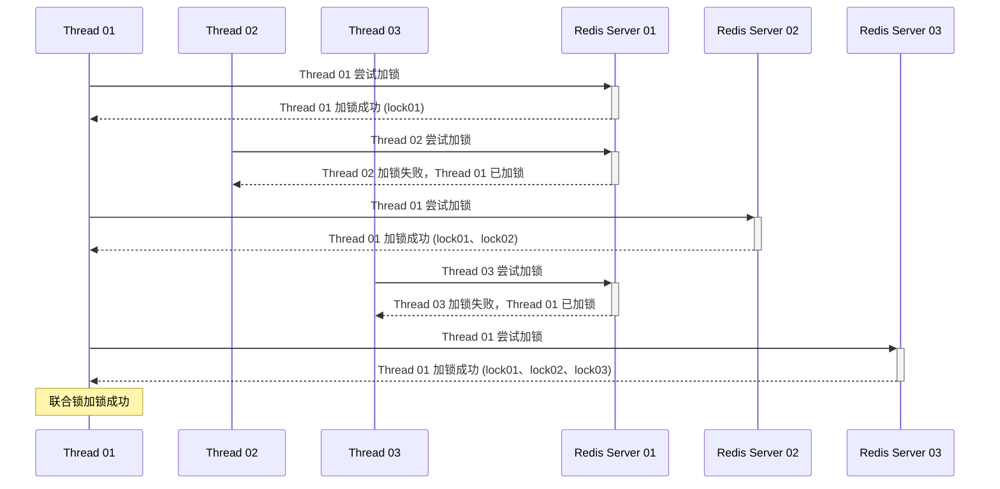
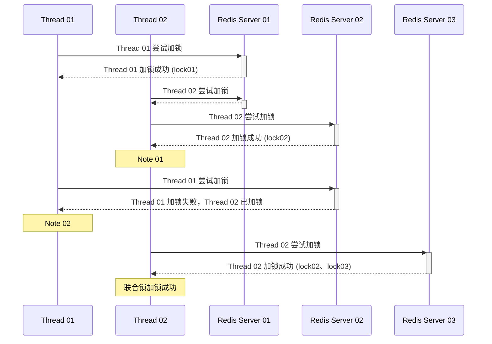
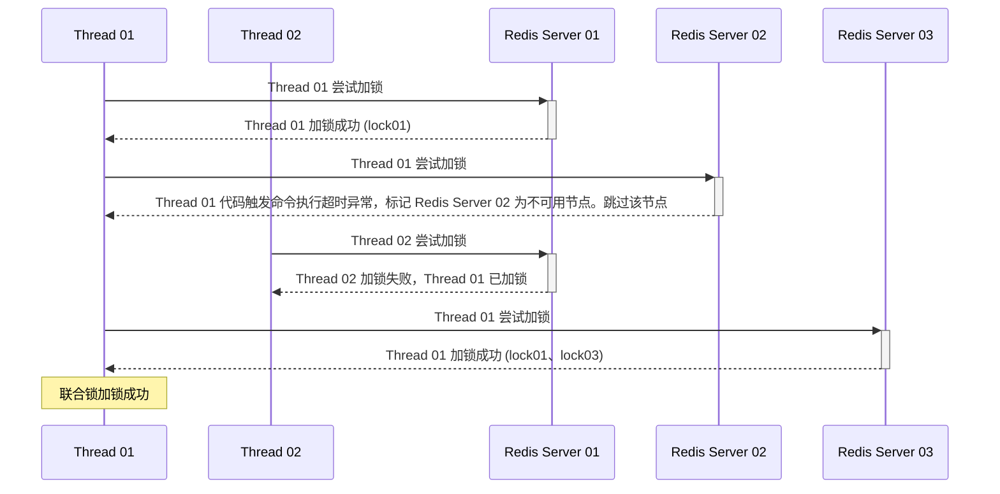
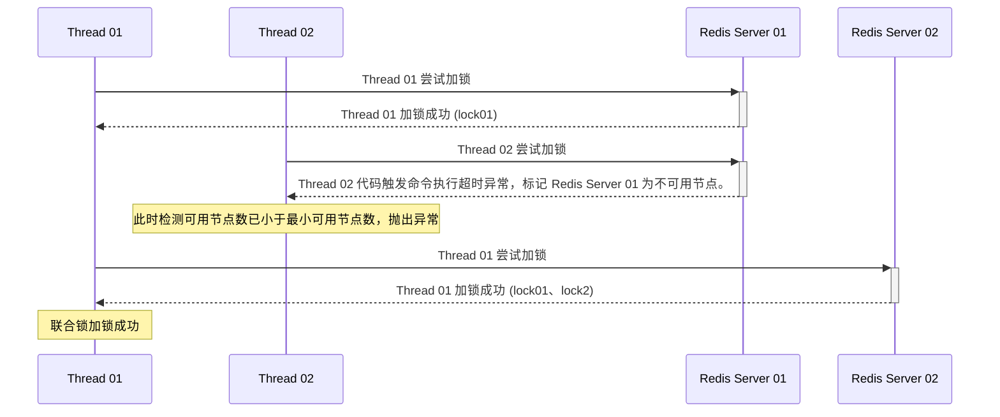

[toc]

----

# <font face="宋体" color=#ED7D31>Bedrock</font>

## <font face="宋体" color=#5B9BD5>一、导论</font>

### <font face="宋体" color=#7030A0>1、功能简述</font>

Bedrock (基岩) ，是为一个类似于工具包的项目。旨在开源个人开发的一些功能模块化类。如当前的分布式锁。在未来将有其他的一些小组件类添加到其中。

### <font face="宋体" color=#7030A0>2、模块划分</font>

当前划分为 slate 和 ecosphere 两个模块。在 Slate (岩板) 模块的中存放的是开发完成的模块化类，而 ecosphere  (生态圈) 则是存放针对这些类的测试用例。

当前 ecosphere  使用 SpringBoot V2.7.17。整个模块中所用到的依赖均和 spring-boot-dependencies 保持一致。

##  <font face="宋体" color=#5B9BD5>二、功能模块</font>

### <font face="宋体" color=#7030A0>1、分布式锁</font>

#### <font face="宋体" color=#4CAF50>1.1、简述</font>

对于分布式锁来说，可以基于 Redis 也可以基于 Zookeeper 实现。当前只开发出基于 Redis 的分布式锁——分布式全局独锁、分布式全局联合锁。它们都继承自 JUC Lock 接口，其在原理上既是自旋锁也是阻塞锁，支持锁的互斥性、重入性和阻塞性，能杜绝死锁的产生。不管是独锁还是联合锁它们都是非公平锁。

#### <font face="宋体" color=#4CAF50>1.2、锁结构与相关特性</font>

使用 Redis 的 Hash 数据结构来实现分布式锁，其中 key 为分布式锁名称，field 为锁持有者标识，value 为锁重入次数。可在工厂类中自由指定分布式锁名称，而程序将根据线程名称自动生成锁持有者标识。

单次加锁动作，若存在锁则锁重入计数递增 1，未存在则创建分布式锁并设置重入计数为 1。单次解锁动作即将重入计数递减 1。计数归零时代表锁释放。

#### <font face="宋体" color=#4CAF50>1.3、锁通用的时间参数</font>

**分布式锁失效时间**

控制整个分布式锁的失效时间。锁延期任务永远在失效时间过半时被激活运行，以将 TTL 时间重新设置为锁失效时间。

**线程自旋等待时间**

即使是 JUC 的 AQS 中也难逃 CAS 的窘迫。所以此参数也是不可或缺的。对于该参数的设置可以依据单次加锁耗时适量增加。

#### <font face="宋体" color=#4CAF50>1.4、分布式独锁</font>

针对单一服务器实例加锁和解锁，在当前的设计中有两种锁：Redis 分布式全局独锁和 Zookeeper 全局独锁，但是 Zookeeper 全局独锁暂未实现。

对于 Redis 分布式全局独锁 (RedisDistributedGlobalSingleLock) 来说，在整个应用程序运行当中只需要创建一次，之后即可在应用程序的任何地方调用其 Lock 接口的任意方法实现加锁和解锁。对比同类型的 Redission 中的 RLock，回避了其需要多次创建的弊端，有效的减轻了 GC 的负担。其一次创建全局可用的核心是将线程所需的各项参数封装为一个上下文对象，之后存储到 ThreadLocal 当中。这样数据在无参跨方法传递的同时也保证基础参数的多线程共享。

**使用方法**

使用 DistributedGlobalSingleLockFactory 构建 RedisDistributedGlobalSingleLock 实例，注册到 IOC 容器之后即可全局任意地方使用。

#### <font face="宋体" color=#4CAF50>1.5、分布式联合锁</font>

针对多个 Redis 实例加锁和解锁。与独锁同样，其也是一把全局锁，只需创建一次即可在任何地方使用。其设计借鉴了 Redis 之父的 RedLock 设计思想。目的是使用冗余节点避免 Redis 服务器宕机时造成的锁丢失的问题。

**使用方法**

使用 DistributedGlobalCombinationLockFactory 构建 RedisDistributedGlobalCombinationLock 实例，注册到 IOC 容器之后即可全局任意地方使用。

##### <font face="宋体" color=#00BCD4>1.5.1、锁丢失问题</font>

在线程加锁的过程中，可能出现之前已经加锁成功的 Redis 服务器突然宕机，当其再次可用之后会导致已添加的锁超时失效的情况。这就被称为锁丢失。

##### <font face="宋体" color=#00BCD4>1.5.2、联合锁之中的竞争</font>

依据 RedLock 之中的思路，通过对 Redis 多个实例的加锁来解决锁丢失问题。这个方法极大的保证了程序的高可用性。但是这就带来了另外一个问题：多线程同时对多个 Redis 实例加锁，如何保证有效性，如何在容错的前提下保证锁竞争的互斥呢？

对于这个问题，我的解决方案是：顺序竞锁 + 最左权重原则。

###### <font face="宋体" color=#FFA000>1.5.2.1、顺序竞锁</font>

所有线程按 Redis 实例节点传入顺序从左至右申请加锁。这样可避免死锁的发生。同样在解锁时采用逆序解锁。

###### <font face="宋体" color=#FFA000>1.5.2.2、最左权重原则</font>

在联合锁的竞争中，第一位加锁成功的线程并不永远锁的第一持有人 (第一名并不永远都是第一名) 。可能其加锁成功的 Redis 实例会在判定联合锁加锁成功期间全部出现宕机，之后其他线程后发先至的判断当前无分布式锁，所以 "顺理成章" 的获得了下一 Redis 实例的锁。此时第一位加锁成功的线程就好像没有加锁成功一样，那么鉴于这个后发者好像合理的持有了分布式锁，也就只能判定第一位加锁成功的线程竞争锁失败，此时由后发者继续进行后续加锁，若其未加锁超时则可判定其联合锁加锁成功。

这种一个线程先于其他线程在左端加锁成功即可额获得之后 Redis 实例的加锁机会，而其他线程一旦竞争失败则只能等待的竞锁方式就是最左权重原则。

在最左权重原则中，第一名并非永远都是第一名，它需要准备和其他线程进行全线争斗，只有在一个恒定节点上力压群雄才能最终竞争得锁，并且这个过程不能超时。

###### <font face="宋体" color=#FFA000>1.5.2.3、最左权重原则之中的三种锁竞争情况</font>

1. Redis 服务器均未异常宕机



2. 第一序列的 Redis 服务器异常宕机




> Note 01：后发而先至竞锁成功，根据最左权重原则，它将拥有向后序节点加锁的权利
>
> Note 02：根据最左权重原则，Thread 01 将丧失继续加锁的权利，并立即判定为联合锁加锁失败


3. 第一序列以外的 Redis 服务器异常宕机



###### <font face="宋体" color=#FFA000>1.5.2.4、加锁成功的判断</font>

在不突破最小可用节点数限制的情况下，对**所有可用的 Redis 实例加锁成功且全程未超时**。在可控制锁超时时间的情况下，只要保证全部节点加锁成功即可，若节点宕机则会触发异常并自动跳过。

###### <font face="宋体" color=#FFA000>1.5.2.5、对锁有效性的宽泛要求与冗余节点设计</font>

依据最左权重原则，可以解决掉大部分的线程竞锁排序问题，但还有种例外情况。即在 Redis 可用实例数刚好为最小可用节点数的时候。若线程对各个 Redis 实例加锁中，之前加锁成功的 Redis 突然宕机。对于其他线程来说，只要还有一台加锁成功的机器留存，那么最左权重原则依然还是会生效即立即判定其竞锁失败。但对于正在加锁的线程来说有两种选择：① 立即放弃当前持有的锁 ② 继续加锁。

在我看来，分布式锁存在的意义就是为了让各个线程有一个有序的执行序列，而对于锁来说，存在的个数倒且不那么重要。而在当前其他线程已经 "察觉" 到现有节点数不能支持其联合锁的竞争而抛出异常时，正在加锁的线程可以继续加锁，之后判定其联合锁加锁成功。好让剩余的可用节点最后释放一次余热。其执行如下时序图所示：



依据上述设计和线程运行结果可推导出：在最左权重原则下，为联合锁所准备的最小可用 Redis 节点数可为 2。自 2 以上开始的即为冗余节点。

##### <font face="宋体" color=#00BCD4>1.5.3、联合锁当中的时间参数</font>

###### <font face="宋体" color=#FF9966>1.5.3.1、独锁操作时间</font>

联合锁，本质就是联合多个独锁，而对每个 Redis 实例的加锁操作即视为一个独锁操作。而独锁操作时间是为了更加直观的控制联合锁中各个独锁的使用效率而定，通过其可以使用套用公式显而易见的得到整个联合锁的加锁超时时间。

###### <font face="宋体" color=#FF9966>1.5.3.2、联合锁的加锁超时时间</font>

若有设定则为设定时间，未设置则为基础等待时间 (独锁操作时间 * 锁数量 + 100) 。单位为毫秒。

###### <font face="宋体" color=#FF9966>1.5.3.3、不可用节点间隔重试时间</font>

**节点容错中的异常传播**

在加锁时，若 Redis 宕机则会触发 RedisCommandTimeoutException 异常。命令超时参数由传入的 RedisURI 携带。若未设置则默认设置 5ms 的超时时间。在触发该异常时，会标识当前 Redis 节点不可用，同时记录节点不可用开始时间。这个不可用标识是全局的。设置的目的是避免对不可用节点的大量访问。

> 在代码中捕获 RedisConnectionException 异常是为保险起见而为之。在锁的运行期间 debug 调试，未碰见触发这个异常的情况。当然如果传入的 RedisURI 有误则会在工厂类的初始化逻辑中触发这个异常。

**不可用节点自动重试**

联合锁默认会在节点不可用 15 分钟之后对节点执行 ping 操作。若 ping-pong 机制正常则立即标识该节点可用，反之 (抛出异常) 则刷新不可用开始时间。并等待下一周期的测试。间隔重试时间可在工厂类构造器中指定，单位为毫秒。

#### <font face="宋体" color=#4CAF50>1.6、自实现的 AQS</font>

在初始的分布式锁中，独锁和联合锁并不是全局可用的。使用方式是使用一次而创建一次。并且底层虽然使用 Lua 脚本保证锁操作的原子性，但线程之间的竞争是直接通过 CAS 自旋等待来实现的。这在小量并发下可能无妨，但高并发下就暴露了其对 GC 不友好和过量占用 CPU 的问题。所以为了优化 GC 不友好这个问题，独锁和联合锁改进为了全局锁。而为了避免 CAS 过量占用 CPU 资源则使用 LockSupport 来阻塞和唤醒线程。

考量到代码的优雅和扩展性，特借鉴于 JUC 的 AQS ，在保留整体框架逻辑的同时，也对其进行了部分改装和设计方面的妥协。比如：

- 添加了部分回调方法
- 对 unsafe 类的不通转而只能使用 AtomicReference 来操作队列的头节点和尾节点。不过虽然是代码设计方面的妥协，但并不会造成节点丢失的问题。因为头节点和尾节点的更新操作都是原子的，而队列中也就只有这两点会有大量线程去竞争更新，保证了头节点和尾节点的原子性更新即保证了整个队列的有效性。

相比于 JUC 的 AQS，自实现的 AbstractQueuedSynchronizer 只维护一个有序访问流，这是一个双向的 FIFO 链表。其核心逻辑就是依据这个有序链表利用 LockSupport 实现线程的等待与被动唤醒机制，从而避免了高并发下大量的 CAS 自旋等待竞争。

<font face="宋体" color=#00BCD4>1.6.1、Competitor</font>

AbstractQueuedSynchronizer 接受一个 Competitor 接口类型的泛型参数，其表明链表节点中存储的对象类型。

```java
public abstract class AbstractQueuedSynchronizer<T extends Competitor> extends AbstractExclusiveAccessSynchronizer {
	protected volatile AtomicReference<CompetitorQueuedNode<T>> head;
	protected volatile AtomicReference<CompetitorQueuedNode<T>> tail;
}
```

Competitor 是一个锁竞争者标记接口。其内部定义了四种回调方法，会在 AQS 队列节点的执行期间按顺序调用。而其子类则封装竞争者特有的数据，以便于在 AQS 的执行逻辑中访问和调用。

对于每个 Competitor 实现类来说，其 equals、hashCode 总是比对它的锁持有者标识。因为 ASQ 中的 Competitor  实例间比对都是使用 "=="，这样它效率最高。


